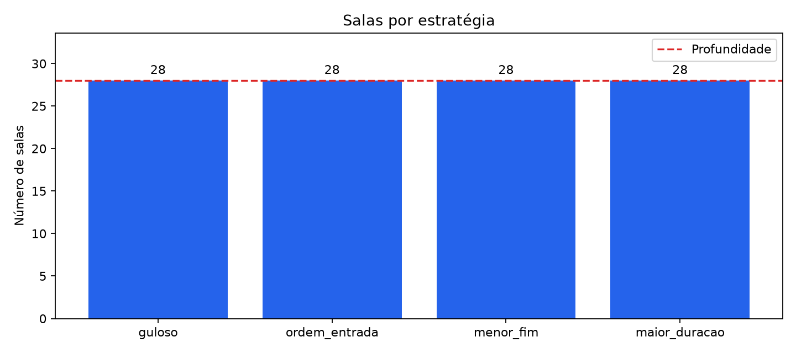
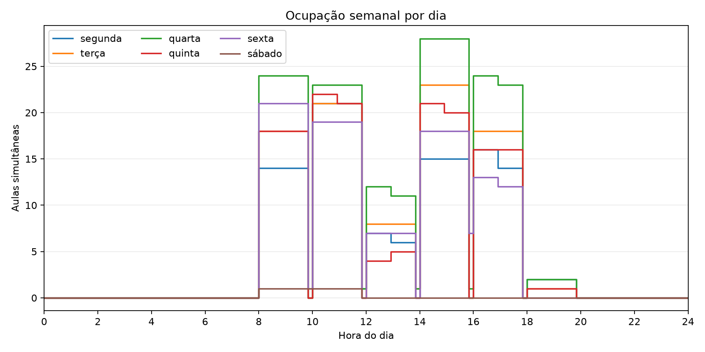
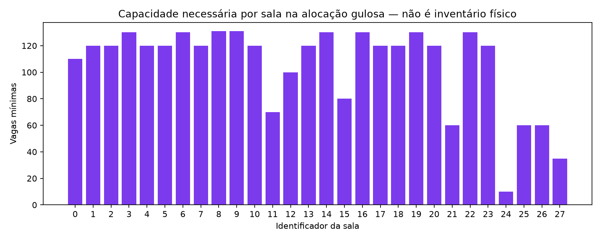

# Salas da UnB

**Número do Grupo:** 44  ·  **Conteúdo da Disciplina:** Algoritmos Gulosos

Dada a oferta de turmas de um semestre da UnB, quantas salas são necessárias, no mínimo, para que nenhuma aula se sobreponha a outra na mesma sala?

## Alunos

| Matrícula | Aluno |
|---|---|
| _a preencher_ | Giovanni Dornelas Ferreira |
| _a preencher_ | _a preencher_ |

## Sobre

O problema é o de **Particionamento de Intervalos** (*interval partitioning*): cada aula é um intervalo de tempo, e queremos distribuir todos os intervalos no menor número de salas de modo que, dentro de uma sala, nenhum par se sobreponha.

O estudo usa a oferta de graduação da **UnB Gama (FCTE), semestre 2026.2**.
Os encontros semanais são extraídos dos códigos de horário do SIGAA.
Além da alocação de todas as aulas em salas, o projeto implementa a seleção
do maior número de reservas compatíveis para um auditório em um dia.

## O algoritmo

### Alocação de salas

A função `alocar(aulas)`, de [src/guloso.py](src/guloso.py), resolve o
particionamento de intervalos. Cada encontro é um
`Aula(turma, dia, inicio, fim, vagas)`: os dias vão de 2 (segunda-feira)
a 7 (sábado), e os horários são minutos desde 00:00. O intervalo é
**semiaberto**, `[inicio, fim)`, portanto uma aula que termina às 10:00
pode compartilhar a sala com outra que começa às 10:00.

O algoritmo processa cada dia separadamente:

1. Ordena as aulas por horário de início, mantendo seus índices originais.
2. Mantém um heap mínimo de pares `(fim, sala)`, com o fim da última aula
   atribuída a cada sala. O topo indica a sala que libera primeiro.
3. Se o topo tiver `fim <= inicio` da aula atual, reutiliza essa sala e
   atualiza seu fim no heap.
4. Caso contrário, abre uma nova sala e insere seu par no heap.
5. Registra o número da sala na posição original da aula.

O retorno é uma `list[int]`, com `salas[i]` indicando a sala de `aulas[i]`.
A entrada não é modificada. As salas são numeradas a partir de zero em
cada dia: a sala 0 de segunda-feira e a sala 0 de terça-feira representam
a mesma sala física. Por isso, o número de salas da semana é o **máximo
dos totais diários**, e não sua soma. Para uma entrada vazia, o retorno é
`[]` e são necessárias zero salas.

Exemplo em uma segunda-feira:

| Aula | Intervalo | Sala |
|---|---|---|
| A | 08:00–10:00 | 0 |
| B | 09:00–11:00 | 1 |
| C | 10:00–12:00 | 0 |

Nesse exemplo, `alocar(aulas)` retorna `[0, 1, 0]`: A e B se sobrepõem,
mas C pode reutilizar a sala de A exatamente às 10:00.
O campo `vagas` é preservado nos dados; o modelo considera salas
intercambiáveis e não impõe restrições de capacidade ou equipamento.

### Prova de otimalidade

A **profundidade** é o maior número de aulas simultâneas em um mesmo dia
e instante. Se há `D` aulas simultâneas, qualquer alocação sem conflitos
precisa de pelo menos `D` salas. Esse limite inferior é calculado por
`profundidade(aulas)`, de [src/limite.py](src/limite.py).

Primeiro, o guloso sempre produz uma alocação válida. Ao reutilizar uma
sala, a última aula nela termina até o início da nova aula. Como as aulas
são processadas por início, a nova aula também não conflita com as aulas
anteriores dessa sala. Ao abrir uma sala, ela está vazia. Aulas em dias
diferentes não se sobrepõem.

Agora suponha que, em um dia, o algoritmo abra a **d-ésima sala**
(identificador `d - 1`) para uma aula que começa no instante `t`.
Para `d = 1`, a própria aula já exige uma sala. Para `d > 1`, a abertura
só ocorre quando o menor fim no heap é maior que `t`.
Logo, a última aula de cada uma das `d - 1` salas existentes termina
depois de `t`. Todas essas aulas começaram até `t`, pois foram processadas
antes da aula atual. Assim, elas estão acontecendo em `t`, juntamente
com a aula atual: há **d aulas simultâneas**. Qualquer solução precisa,
portanto, de pelo menos `d` salas.

Aplicando esse argumento à abertura da última sala do dia, o guloso usa
exatamente o mínimo necessário naquele dia. Os conjuntos de salas podem
ser reutilizados entre dias; consequentemente, o mínimo semanal é o
máximo dos mínimos diários. Concluímos que o número de salas do guloso é
igual à profundidade `D` de todo o conjunto, atingindo o limite inferior.

### Complexidade

Para `n` aulas, o agrupamento por dia custa **O(n)**. A ordenação custa
**O(n log n)** no total, e cada aula faz uma operação de heap de custo
**O(log n)**. Portanto, o tempo total é **O(n log n)** e o espaço auxiliar
é **O(n)**, incluindo os grupos, os heaps e a lista de alocação.

### Seleção de reservas em um auditório

O módulo [src/selecao.py](src/selecao.py) trata a variante em que há apenas
um auditório e queremos atender o maior número de pedidos em um dia.
`selecionar(pedidos)` ordena os pedidos por **menor horário de fim** e
aceita cada pedido que começa depois ou exatamente no fim do último
aceito. Retorna os pedidos escolhidos, com tempo **O(n log n)**.

A escolha é ótima por um argumento de troca: seja `g` o pedido que
termina mais cedo e `o` o primeiro pedido de uma seleção ótima.
Como `fim(g) <= fim(o)`, substituir `o` por `g` preserva a quantidade de
pedidos e a compatibilidade com todos os pedidos seguintes. Portanto,
existe uma solução ótima que começa com `g`. Repetindo o argumento nos
pedidos que começam a partir de `fim(g)`, obtemos a seleção gulosa inteira.

## Os dados

A fonte é a [consulta pública de turmas do SIGAA](https://sigaa.unb.br/sigaa/public/turmas/listar.jsf).
O arquivo usado é `data/raw/turmas_gama_2026_2.csv`, em UTF-8, com cabeçalho
`turma,disciplina,horario,vagas` e uma linha por turma. A coleta contém
**229 turmas**, que geram **430 aulas semanais**, sem horários ausentes ou
inválidos. O recorte usa a unidade ofertante do Gama, mesmo quando o local
informado para uma turma fica em outro campus.

As instruções de obtenção, normalização e conferência estão em
[data/README.md](data/README.md). `data/raw/` não é versionado: após clonar,
obtenha o CSV conforme essas instruções ou use o exemplo de `tests/` para
experimentar o programa. `carregar_aulas(caminho)` relata em stderr as
turmas descartadas e as contagens da leitura.

## Validação

[validacao.py](validacao.py) executa o guloso e as três estratégias de
[src/linhas_base.py](src/linhas_base.py): primeira sala compatível na ordem
de entrada, por menor fim e por maior duração. Confere o contrato das
alocações, conta conflitos e compara o número de salas com a profundidade.

Também compara guloso, profundidade e busca exata em subamostras de até
**12 aulas**. Por padrão, são 10 amostras sorteadas com semente 44.
Os índices sorteados são registrados nos resultados para reprodução.
Os tempos em milissegundos medem cada algoritmo e variam entre execuções;
não incluem a conferência de conflitos nem a gravação dos CSVs.

## Achados

Na coleta de 2026.2 descrita acima, o guloso e as três linhas de base usam
**28 salas**, sem conflitos. A profundidade também é 28, comprovando que
esse total é mínimo para os intervalos e as restrições do modelo.
Guloso, profundidade e exato concordam nas 10 subamostras padrão.

As linhas de base acertarem nessa coleta não implica otimalidade em todas
as entradas. Os testes incluem um caso em que a primeira sala compatível
na ordem de entrada usa três salas, enquanto o guloso usa apenas duas.
O resultado de 28 salas considera salas intercambiáveis; capacidade,
equipamentos e deslocamento entre locais não são restrições deste modelo.

O dimensionamento dessa alocação gulosa exige capacidades entre **10 e
131 vagas por sala**, somando **2.947 lugares** nas 28 salas. Cada valor
é o maior número de vagas de uma aula atribuída à sala durante a semana.
Essa soma descreve a alocação obtida; não é uma prova de que a soma de
capacidades seja mínima. Sem um inventário físico, não podemos afirmar
que as salas existentes no campus comportam essa distribuição.







As figuras versionadas correspondem à coleta descrita acima. Os arquivos
SVG para exportação também estão em [docs/graficos/](docs/graficos/).

### Capacidade das salas

[src/capacidade.py](src/capacidade.py) implementa
`capacidades_minimas(aulas, salas)`, que dimensiona cada sala de uma
alocação, e `excessos_de_capacidade(aulas, salas, capacidades)`, que retorna
os índices das aulas que excedem a capacidade informada.

Com um inventário fornecido, `alocar_com_capacidade(aulas, capacidades)`
processa as aulas por início e escolhe a menor sala livre que comporte
suas vagas. Nos empates de início, prioriza mais vagas. A posição na lista
de capacidades identifica a mesma sala física em todos os dias.
O tempo é **O(n log n + n·s)**, para `s` salas disponíveis.

Essa estratégia é uma heurística: pode falhar mesmo quando existe uma
alocação viável e não tem a prova de otimalidade do particionamento sem
restrições. Uma falha informa essa limitação e encerra a execução com erro.

## Instalação

Requer Python 3.10 ou mais novo. Os comandos rodam da raiz do repositório.
Os algoritmos e a validação usam a biblioteca padrão. A geração de
gráficos requer Matplotlib, declarado em `requirements.txt`.

No Windows, com PowerShell:

```powershell
python -m venv .venv
.\.venv\Scripts\Activate.ps1
python -m pip install -r requirements.txt
```

No Linux ou macOS:

```bash
python3 -m venv .venv
source .venv/bin/activate
python -m pip install -r requirements.txt
```

## Uso

Com o CSV da coleta em `data/raw/turmas_gama_2026_2.csv`, execute:

```bash
python validacao.py
python graficos.py
```

Para experimentar sem a coleta real, use o CSV fictício versionado:

```bash
python validacao.py tests/turmas_exemplo.csv --saida resultados/exemplo --amostras 3 --tamanho 6 --semente 44
python graficos.py resultados/exemplo
```

O exemplo contém horários ausentes e inválidos para demonstrar o relato
de descartes; apenas as turmas com dados válidos entram na alocação.

As opções disponíveis são:

| Argumento | Finalidade | Padrão |
|---|---|---|
| `caminho` | Caminho do CSV de entrada, argumento posicional opcional. | `data/raw/turmas_gama_2026_2.csv` |
| `--saida` | Diretório onde os CSVs são gravados. | `resultados/` |
| `--amostras` | Quantidade de subamostras; zero desativa a busca exata. | `10` |
| `--tamanho` | Máximo de aulas por amostra, entre 1 e 12. | `12` |
| `--semente` | Semente do sorteio reproduzível das subamostras. | `44` |
| `--capacidades` | Capacidades do inventário, na ordem sala 0, sala 1, etc.; acrescenta a estratégia `capacidade_best_fit`. | Não informado |

O tamanho efetivo de cada amostra é limitado pela quantidade de aulas da
entrada. Consulte também `python validacao.py --help`.

Por padrão, a execução imprime duas tabelas e salva:

| Arquivo | Conteúdo |
|---|---|
| `resumo.csv` | Aulas, salas, limite, excesso de salas, conflitos e tempo por estratégia. |
| `alocacoes.csv` | Estratégia, índice original da aula, turma, dia, início, fim, vagas e sala. |
| `subamostras.csv` | Índices e semente do sorteio, resultados do guloso e exato, limite, concordância e tempos. |
| `capacidades.csv` | Capacidade mínima por sala e estratégia; capacidade informada e adequação quando o inventário é usado. |

Esses arquivos são recriados a cada execução no diretório escolhido.
`resultados/` não é versionado. No resumo, `excesso = salas - limite` e
`conflitos` conta pares de aulas sobrepostas na mesma sala. A linha do
limite tem o campo de conflitos vazio, pois não representa uma alocação.
O programa termina com código 1 se encontrar conflitos, divergências nas
subamostras ou um erro que impeça a validação completa.

Para testar um inventário **fictício** de duas salas com 40 e 80 lugares:

```bash
python validacao.py tests/turmas_exemplo.csv --saida resultados/exemplo --capacidades 40 80
```

O guloso e as linhas de base continuam avaliados no modelo de salas
intercambiáveis. Somente `capacidade_best_fit` usa o inventário fornecido.
Para ela, a profundidade é um limite inferior, sem garantia de ser atingível
com aquelas capacidades. Os campos de capacidade informada e adequação
das outras estratégias ficam vazios.

`graficos.py` lê os CSVs da validação e salva quatro figuras em PNG e SVG:
comparação de salas, tempos, ocupação diária e dimensionamento do guloso.
A saída padrão é `<diretório de resultados>/graficos/`; use `--saida` para
alterá-la. O gráfico de tempos retrata uma única execução, sem constituir
um benchmark. Para regenerar as figuras versionadas com a coleta real:

```bash
python validacao.py
python graficos.py --saida docs/graficos
```

### Usar os módulos diretamente

```python
from src.guloso import alocar
from src.limite import profundidade
from src.modelo import Aula

aulas = [Aula("A", 2, 480, 600), Aula("B", 2, 540, 660), Aula("C", 2, 600, 720)]
salas = alocar(aulas)
print(salas)                 # [0, 1, 0], na ordem original
print(len(set(salas)))       # 2 salas
print(profundidade(aulas))   # 2
```

Para selecionar reservas de um auditório em um único dia:

```python
from src.modelo import Aula
from src.selecao import selecionar

pedidos = [Aula("Longa", 2, 480, 720), Aula("A", 2, 480, 600), Aula("B", 2, 600, 720)]
escolhidos = selecionar(pedidos)
print([pedido.turma for pedido in escolhidos])  # ['A', 'B']
```

Para conferir uma instância pequena, use
`src.exato.minimo_de_salas(aulas)`: retorna um inteiro e aceita até 12 aulas.
`selecionar` retorna pedidos do tipo `Aula` e exige que todos sejam do mesmo dia.

## Testes

```bash
python -m unittest discover
```

Para executar apenas os testes de um módulo, por exemplo:

```bash
python -m unittest tests.test_guloso -v
```

Os testes de dados reais são pulados quando
`data/raw/turmas_gama_2026_2.csv` não existe. Os demais usam exemplos
versionados, arquivos temporários e instâncias aleatórias com semente fixa.
Há comparações do guloso com a profundidade e a busca exata, e da seleção
de reservas com enumeração de subconjuntos por força bruta.
Os testes de capacidade verificam conflitos, reutilização entre dias e
limites de vagas. Os de gráficos conferem os eventos de intervalos
semiabertos e a exportação dos arquivos; a exportação é pulada se
Matplotlib não estiver instalado.

## Apresentação

**Vídeo de apresentação:** ainda não gravado. O link será incluído após
a gravação e publicação pela equipe.

## Referências

- KLEINBERG, J.; TARDOS, É. *Algorithm Design*. Pearson, 2005. Seção 4.1:
  seleção e particionamento de intervalos. Material complementar:
  [Greedy Algorithms I, slides de Kevin Wayne, Princeton](https://www.cs.princeton.edu/~wayne/kleinberg-tardos/pdf/04GreedyAlgorithmsI.pdf).
- CORMEN, T. H.; LEISERSON, C. E.; RIVEST, R. L.; STEIN, C.
  [*Introduction to Algorithms*](https://mitpress.mit.edu/9780262033848/introduction-to-algorithms/).
  3. ed. MIT Press, 2009. Capítulo 16: algoritmos gulosos e seleção de atividades.
- UNIVERSIDADE DE BRASÍLIA. [Consulta pública de turmas do SIGAA](https://sigaa.unb.br/sigaa/public/turmas/listar.jsf).
  Fonte da oferta de graduação do Gama em 2026.2; conteúdo recebido em 05/10/2026.
- DESIGN UNB. [Códigos das aulas SIGAA](https://design.unb.br/codigos-aulas-sigaa/).
  Referência para dias, turnos e horários. A adaptação do intervalo N1 está
  documentada em [src/horarios.py](src/horarios.py).
- PYTHON SOFTWARE FOUNDATION. [Documentação de `heapq`](https://docs.python.org/3.10/library/heapq.html).
  Referência para o heap mínimo usado na alocação de salas.
